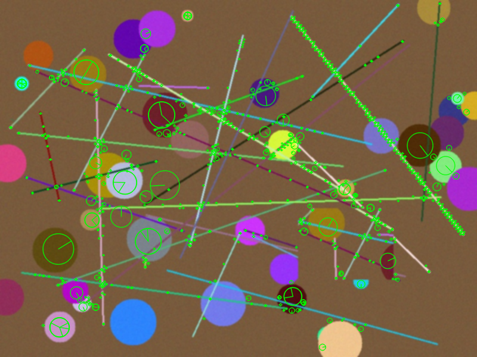
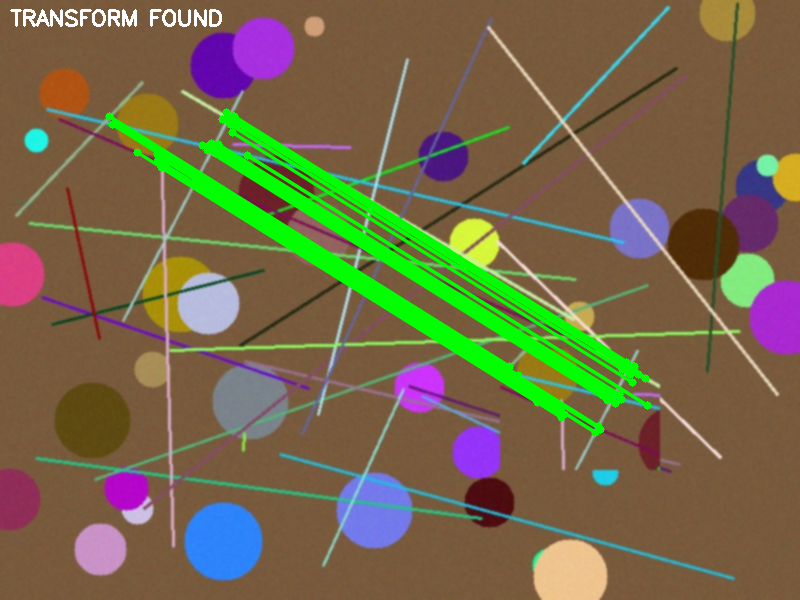
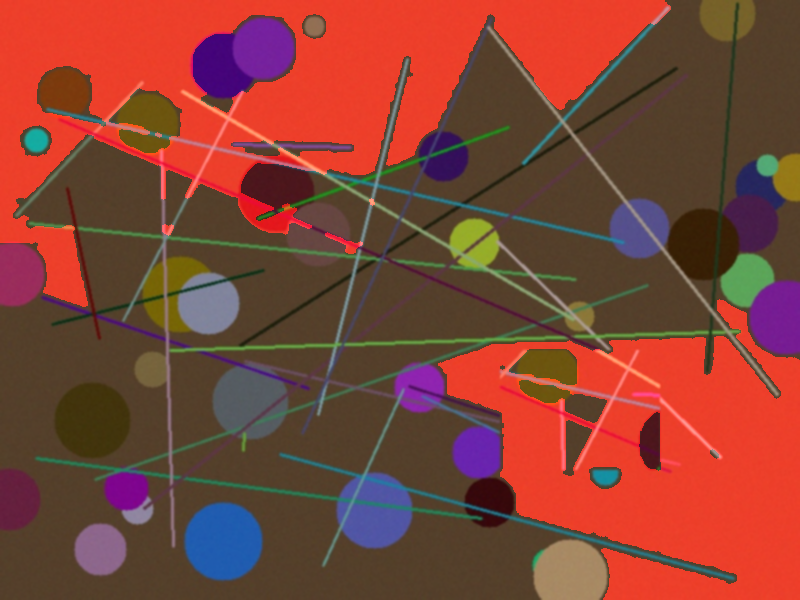
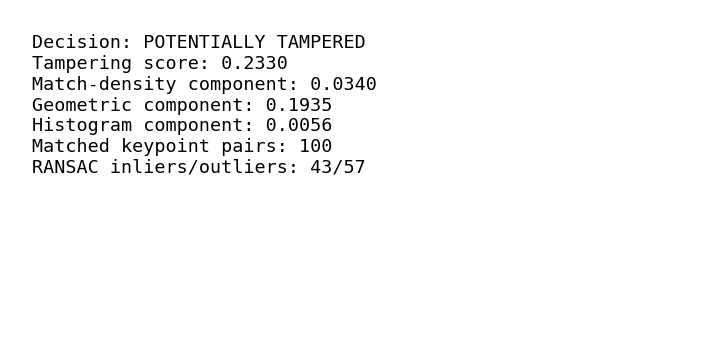

# Computer Vision Based Image Tampering Detection

**Using Feature Consistency, Segmentation and Geometric Verification**

A classical (non-deep-learning) Computer Vision system that analyzes a
single image and determines whether it is likely authentic or has been
copy-move tampered, localizing the suspicious region(s) using SIFT feature
matching, graph-based segmentation, and RANSAC geometric verification.

Built as a CSE3010 (Computer Vision) course project.

---

## 1. Overview

Most "AI tampering detectors" are black-box deep neural networks: an image
goes in, a probability comes out, and nobody — including the model's
author — can point to *why*. This project takes the opposite approach: it
builds a fully classical, inspectable pipeline where every number in the
final decision can be traced back to a specific, explainable geometric or
statistical computation.

## 2. Problem Statement

Given a single digital image with no reference original, determine whether
it is authentic or manipulated (primarily copy-move forgery), and localize
the suspicious region, using only classical CV: histogram analysis,
SIFT features, segmentation, and RANSAC — no pretrained deep forensic model.

## 3. Motivation

- Passive image forensics is a real, active research area with genuine
  practical relevance (misinformation, legal evidence, journalism).
- A classical pipeline forces engagement with the actual mathematics
  behind feature extraction, robust estimation, and segmentation — the
  core of a Computer Vision syllabus — rather than treating CV as "call a
  pretrained model."
- Full explainability: every stage produces an inspectable, visualizable
  intermediate result.

## 4. Objectives

1. Detect copy-move forgery using self-similarity feature matching.
2. Geometrically verify candidate matches with RANSAC to reject
   coincidental/false matches.
3. Localize suspicious regions via segmentation restricted to
   geometrically-verified evidence.
4. Produce a transparent, weighted-sum tampering score and decision.
5. Provide full visual and machine-readable reporting.
6. Support batch evaluation with real classification metrics.

## 5. Key Features

- CLI-only, no GUI dependency
- Modular `src/` package, each module independently testable
- Configurable via a single `config.py` (no hardcoded paths/parameters)
- 10 visual artifacts per analyzed image
- JSON report per image + aggregate evaluation report
- 39 automated tests (unit + integration), all passing (see §18)

## 6. Computer Vision Concepts Used

| Concept | Where |
|---|---|
| Gaussian filtering (low-pass convolution) | Preprocessing |
| Color space conversion (BGR↔Gray, BGR↔LAB) | Preprocessing |
| Histogram processing, chi-square distance | Histogram analysis |
| SIFT: scale-space, DoG, orientation histograms | Feature extraction |
| k-NN descriptor matching, Lowe's ratio test | Feature matching |
| Graph-based segmentation (Felzenszwalb) | Segmentation |
| Morphological closing/opening | Segmentation cleanup |
| Affine transform estimation, RANSAC | Geometric verification |
| Weighted decision fusion | Scoring |

## 7. System Architecture

```
Input Image
   -> Validation
   -> Preprocessing (resize, denoise, grayscale)
   -> Histogram / Block Consistency Analysis
   -> SIFT Feature Extraction
   -> Self-Matching (Lowe's ratio test)
   -> RANSAC Geometric Verification  <-- rejects false matches
   -> Segmentation, restricted to RANSAC-inlier evidence
   -> Tampering Score Fusion
   -> Decision (AUTHENTIC / POTENTIALLY TAMPERED)
   -> Visual + JSON Report
```

**Important design decision:** segmentation-based localization runs
*after* geometric verification and uses only RANSAC-inlier point pairs —
not raw pre-RANSAC matches. Building the mask from raw matches was tried
first and found (via real testing, documented in
`docs/methodology/threshold_calibration.md`) to over-flag large parts of
the image on repetitive-texture content. Using verified inliers only is
both more correct and empirically better localized.

## 8. Workflow

See `docs/diagrams/` for Mermaid sequence, data-flow, and use-case
diagrams.

## 9. Project Structure

```
cv-tamper-detect/
├── README.md
├── statement.md
├── requirements.txt
├── .gitignore
├── main.py                 # CLI entry point
├── config.py                # all tunable parameters, single source of truth
├── src/
│   ├── preprocessing.py         # Module 1
│   ├── histogram_analysis.py    # Module 2 (part)
│   ├── feature_extraction.py    # Module 2 (part)
│   ├── feature_matching.py      # Module 2 (part)
│   ├── segmentation.py          # Module 3
│   ├── geometric_verification.py# Module 4
│   ├── tampering_score.py       # Module 5 (part)
│   ├── visualization.py         # Module 5 (part) / Phase 10
│   └── evaluation.py            # Module 5 (part) / Phase 9
├── data/
│   ├── README.md
│   ├── sample/
│   └── test/{authentic,tampered}/
├── outputs/{visualizations,reports}/
├── tests/
│   ├── test_preprocessing.py
│   ├── test_features.py
│   ├── test_segmentation.py
│   └── test_pipeline.py
├── docs/{architecture,diagrams,methodology}/
└── report/
```

## 10. Requirements

- Python 3.10+
- opencv-python, numpy, scipy, scikit-image, matplotlib (see `requirements.txt`)

## 11. Installation

```bash
git clone https://github.com/<your-username>/<your-repo-name>.git
cd <your-repo-name>
python3 -m venv venv
source venv/bin/activate        # Windows: venv\Scripts\activate
pip install -r requirements.txt
```

## 12. Dataset Setup

See `data/README.md`. For evaluation mode, arrange images as:

```
data/test/
├── authentic/*.jpg
└── tampered/*.jpg
```

A small synthetic demonstration set can be generated for testing purposes
(see `data/README.md` for the generation script) — this is **not** a
substitute for a real, published tampering dataset such as CASIA v2 or
CoMoFoD (see §13 for details and access instructions).

## 13. Recommended External Datasets (for real evaluation)

- **CASIA v2.0** — widely used splicing/copy-move forensics dataset.
  Access: search "CASIA Image Tampering Detection Dataset" — distributed
  by the original authors' request form; not redistributed here due to
  licensing.
- **CoMoFoD** — copy-move forgery dataset with categorized manipulation
  types (translation, rotation, scaling, combination) and ground-truth
  masks, useful for IoU-based localization evaluation.
  Access: publicly downloadable from the CoMoFoD project page.

Neither dataset is bundled in this repository (large file size + licensing
terms); `data/README.md` documents exactly how to obtain and arrange them.

## 14. Configuration

All parameters live in `config.py` as dataclasses (`PreprocessingConfig`,
`FeatureConfig`, `SegmentationConfig`, `GeometricConfig`, `ScoringConfig`).
No path or threshold is hardcoded inside `src/` modules.

## 15. Command-Line Usage

```bash
# Single image
python main.py --input path/to/image.jpg --output outputs/

# Batch evaluation over a labeled dataset
python main.py --evaluate --dataset data/test/ --output outputs/

# Verbose logging
python main.py --input path/to/image.jpg --log-level INFO
```

## 16. Example Output (real run, unedited)

```
Input image: data/test/tampered/tamp_1.jpg
Image dimensions: 800x600 (processed: 800x600)
Preprocessing completed: resized=False, scale_factor=1.0000
Histogram analysis: 3 anomalous block(s) out of 108
Features detected: 1030 (SIFT)
Candidate suspicious regions (matched keypoint pairs): 100
Geometric verification: transform_found=True
Inliers: 43
Outliers: 57
Tampering score: 0.2330
Final decision: POTENTIALLY TAMPERED
Results saved to: outputs/reports/tamp_1_report.json
```

### Sample outputs (real run on `tamp_1.jpg`, a synthetic copy-move test image)

| SIFT Keypoints | RANSAC-Verified Matches |
|---|---|
|  |  |

| Final Heatmap Overlay | Summary Panel |
|---|---|
|  |  |

## 17. Expected Outputs Per Image

`outputs/visualizations/<name>_01_original.png` through `_10_summary.png`
(original, preprocessed, histogram plot, keypoints, matches, segmentation
boundaries, candidate mask, RANSAC-verified matches, final heatmap overlay,
summary panel), plus `outputs/reports/<name>_report.json`.

## 18. Testing

39 tests across 4 files, **all passing** (verified, not claimed):

```bash
pytest tests/ -v
# ============================== 39 passed in 4.95s ==============================
```

Covers: invalid file, unsupported format, corrupted image, very small
image, grayscale image, low-quality/heavily-compressed image, image with
insufficient features (flat/textureless), authentic image, manipulated
(copy-move) image, and image with repetitive textures.

## 19. Evaluation

Real run on a small synthetic dev set (3 authentic + 3 copy-move tampered,
generated as described in `data/README.md`), via
`python main.py --evaluate --dataset data/test/`:

| Metric | Value |
|---|---|
| Accuracy | 0.8333 |
| Precision | 1.0000 |
| Recall | 0.6667 |
| F1-score | 0.8000 |
| TP / FP / TN / FN | 2 / 0 / 3 / 1 |

**This is a 6-image illustrative run, not a benchmark result** — see
§20 Limitations and `docs/methodology/threshold_calibration.md` for full,
honest context on how these numbers were obtained and what they do/don't
prove. Re-running `--evaluate` against a real dataset (§13) is required
before citing any accuracy figure in a formal report.

## 20. Limitations

- Reliable primarily for **copy-move** forgery; splicing detection (content
  from a different source image) is only weakly supported via the
  histogram-anomaly signal.
- Performance depends on the image having enough texture for SIFT to find
  keypoints; flat/low-texture regions (sky, blank walls) are a documented
  failure case (see `tests/test_pipeline.py::test_image_with_insufficient_features`).
  On the dev set, a copy-moved patch landing in a lower-texture region
  (`tamp_2.jpg`) was missed (false negative) — a real, observed limitation,
  not hidden.
  On flat synthetic circle-texture images, SIFT keypoints concentrate on
  circle boundaries only, sharply reducing usable matches compared to real
  photographic texture — documented in `docs/methodology/threshold_calibration.md`.
- Repetitive textures can create ambiguous matches; the ratio test and
  RANSAC substantially reduce but do not eliminate this.
- The decision threshold was calibrated on only 6 synthetic images (see
  §19) — not a statistically meaningful calibration; must be redone
  against a real, larger dataset before any accuracy claim is trusted.
- No deep-learning-level robustness to sophisticated splicing/retouching.

## 21. Future Enhancements

- Evaluate against CASIA v2 / CoMoFoD with proper train/dev/test splits.
- Add IoU-based localization metrics once ground-truth tamper masks are
  available (framework already supports this in `src/evaluation.py`).
- Optional lightweight supervised score-fusion layer (e.g. logistic
  regression over the three component scores) once a labeled dataset of
  sufficient size is available, as an alternative to the fixed weighted sum.
- Splicing-specific cues (JPEG double-compression / ELA-style analysis).

## 22. References

- D.G. Lowe, "Distinctive Image Features from Scale-Invariant Keypoints,"
  IJCV, 2004. (SIFT)
- M.A. Fischler, R.C. Bolles, "Random Sample Consensus: A Paradigm for
  Model Fitting," Comm. ACM, 1981. (RANSAC)
- P.F. Felzenszwalb, D.P. Huttenlocher, "Efficient Graph-Based Image
  Segmentation," IJCV, 2004.
- OpenCV, scikit-image official documentation.
