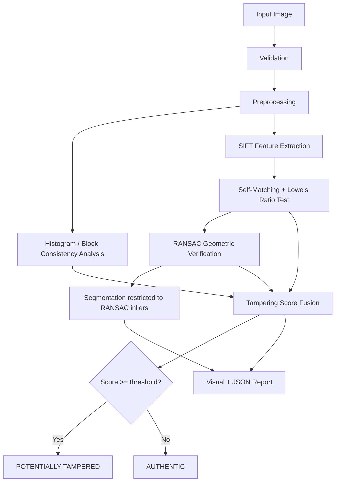
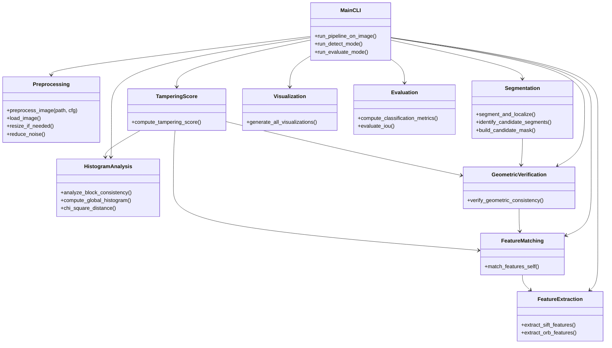
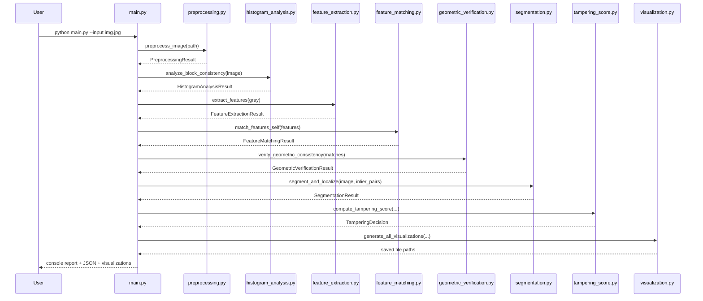
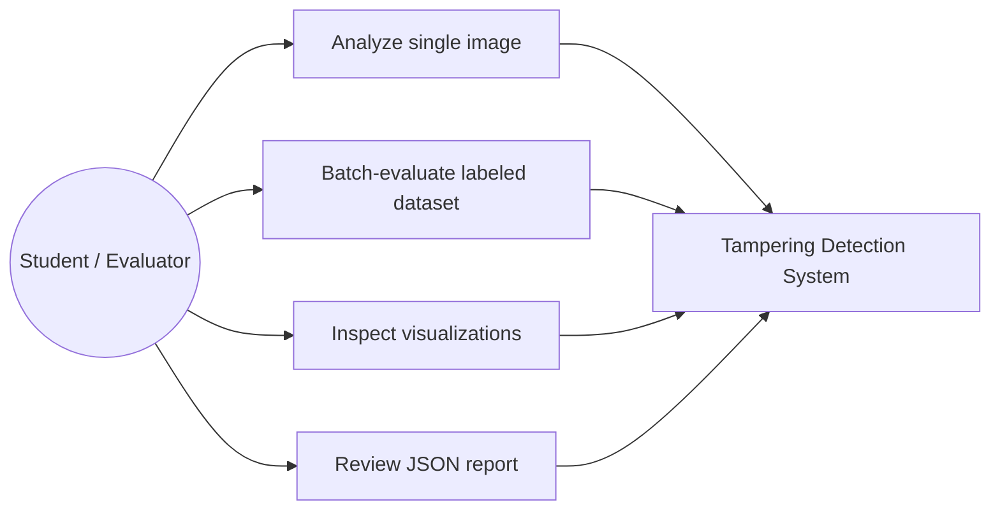
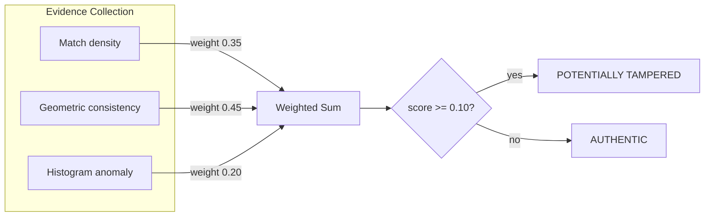

# System Diagrams

## 1. High-Level Data Flow

## 2. Module / Component Diagram

## 3. Sequence Diagram (single-image `detect` run)

## 4. Use Case Diagram

## 5. Algorithm Pipeline (evidence fusion detail)

